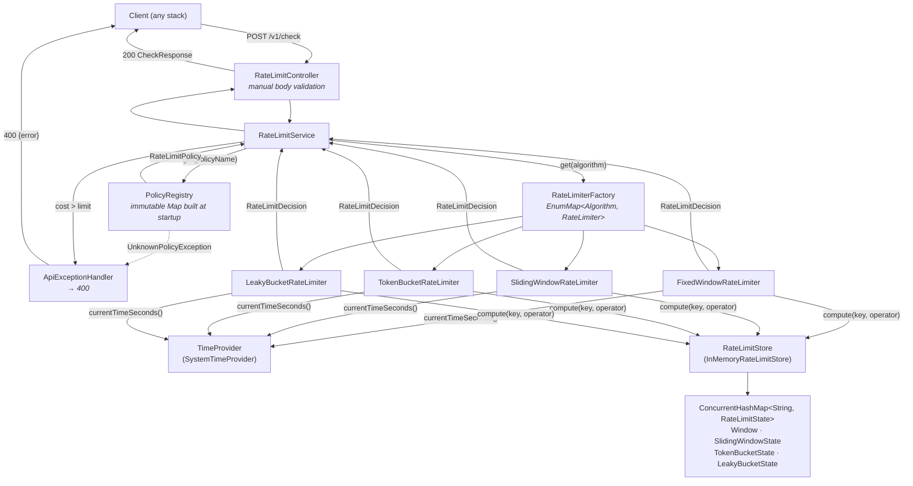

# Rate Limiter

A standalone rate-limiting service built with Spring Boot. Applications call it over HTTP to ask
*"may this caller make this request right now?"* and receive an allow/deny decision plus the
metadata needed to build a `429` response (`limit`, `remaining`, `resetAt`, `retryAfter`).

This document describes **only what is actually in the repository**. Every claim below was verified
against the source, the tests (all 40 currently pass), the Gradle build and the application config.
Anything that could not be verified is called out explicitly.

---

## 1. Overview

### What the project does

The service exposes a single HTTP endpoint, `POST /v1/check`. A caller supplies a **policy name**
(e.g. `login`), a **key** (e.g. a user id or IP address) and an optional **cost**, and gets back a
decision. The policies — algorithm, limit, window size — are declared in `application.yml` and
resolved at startup.

### Why a rate limiter is needed

Any service exposed to untrusted callers needs an admission gate: to stop credential-stuffing against
login endpoints, to keep one noisy tenant from consuming a shared resource pool, to enforce API plan
quotas, and to shed load before it reaches a database. Doing this per-application means reimplementing
the same algorithms in every stack.

### What this implementation solves

- **Four admission algorithms** behind one interface, selected per policy by configuration.
- **Atomic read-modify-write** of limiter state, so concurrent requests for the same key cannot each
  read a stale count and collectively exceed the limit.
- **An injectable clock**, which makes window-boundary and refill behaviour deterministically testable
  without sleeping.
- **A language-agnostic HTTP surface**, so a Node, Python or Go service can use the same limiter.

### Current scope

This is a **working core with a thin HTTP shell**. It is a correct, well-tested, single-process
rate-limiting *library* that happens to be reachable over HTTP. It is **not yet** a deployable
production service: state is in-process and unbounded, the API never returns `429`, there is no
authentication on the endpoint, no metrics, no logging, and no distributed backend.

---

## 2. Current Status

| Feature | Status | Notes |
| --- | --- | --- |
| Fixed Window | ✅ | [`FixedWindowRateLimiter`](src/main/java/com/example/ratelimiter/limiter/FixedWindowRateLimiter.java). 13 tests incl. boundary + concurrency. |
| Sliding Window | ✅ | [`SlidingWindowRateLimiter`](src/main/java/com/example/ratelimiter/limiter/SlidingWindowRateLimiter.java). Weighted-previous-window approximation, not a precise log. 8 tests. |
| Token Bucket | ✅ | [`TokenBucketRateLimiter`](src/main/java/com/example/ratelimiter/limiter/TokenBucketRateLimiter.java). Starts full, burst-tolerant. 9 tests. |
| Leaky Bucket | ✅ | [`LeakyBucketRateLimiter`](src/main/java/com/example/ratelimiter/limiter/LeakyBucketRateLimiter.java). *Meter* form, not a queueing/shaping bucket — documented in the class javadoc. 9 tests. |
| Cost-weighted requests | ✅ | Every algorithm consumes `cost` units, not 1. Tested in all four. |
| Pluggable store abstraction | ✅ | [`RateLimitStore`](src/main/java/com/example/ratelimiter/store/RateLimitStore.java) — one method, with an explicit atomicity contract in its javadoc. |
| In-memory store | ⚠️ | Works and is atomic, but has **no eviction/TTL** — the map grows without bound. See [§13](#13-known-issues--technical-debt). |
| Thread safety | ✅ | Per-key atomic `compute`; verified by four 100-request/20-thread tests. Caveats in [§6](#6-concurrency--thread-safety). |
| Time abstraction | ⚠️ | [`TimeProvider`](src/main/java/com/example/ratelimiter/core/TimeProvider.java) exists and is injected everywhere. But it is **wall-clock, second-granular** — see [§13](#13-known-issues--technical-debt). |
| Factory-based algorithm selection | ✅ | [`RateLimiterFactory`](src/main/java/com/example/ratelimiter/limiter/RateLimiterFactory.java) builds an `EnumMap` from all `RateLimiter` beans; rejects duplicates at startup. |
| Policy configuration | ✅ | `rate-limiter.policies.*` bound via [`RateLimiterProperties`](src/main/java/com/example/ratelimiter/config/RateLimiterProperties.java), validated in [`RateLimitPolicy`](src/main/java/com/example/ratelimiter/core/RateLimitPolicy.java). |
| REST API | 🟡 | One endpoint, `POST /v1/check`. Advisory only — see below. |
| `429` / rate-limit response headers | 🔴 | A denied request returns **HTTP 200** with `allowed: false`. No `Retry-After` or `X-RateLimit-*` headers are ever set. |
| Per-user / IP / API-key / endpoint limiting | 🟡 | Supported only in the sense that the **caller passes an arbitrary key string**. Nothing in the codebase extracts an IP, API key, principal or endpoint. |
| Servlet filter / interceptor | 🔴 | Not present. The service does not rate-limit its own endpoints. |
| Exception handling | 🟡 | [`ApiExceptionHandler`](src/main/java/com/example/ratelimiter/api/ApiExceptionHandler.java) covers 3 exception types → `400`. Several paths are uncovered — see [§10](#10-error-handling). |
| Request validation | 🟡 | Hand-written null/blank/range checks in the controller. No Bean Validation (`spring-boot-starter-validation` is not a dependency). |
| Tests | 🟡 | 40 tests, all passing. Deep on algorithms; **zero** tests for the controller, service, registry, factory, store or exception handler. |
| Logging | 🔴 | No `Logger` is declared anywhere in `src/main`. |
| Metrics / observability | 🔴 | No Actuator, no Micrometer, no health endpoint. |
| Distributed support | 🔴 | No Redis, no shared store, no distributed atomicity. State is per-JVM. |
| Persistence across restart | 🔴 | State is a plain `ConcurrentHashMap`; a restart resets every limit. |
| Deployment config (Docker/CI) | 🔴 | No `Dockerfile`, no CI workflow, no profile-specific config. |
| Project documentation | 🟡 | Good javadoc on `RateLimitStore` and `LeakyBucketRateLimiter`; the previous `readme.md` was a 4-line note. |

---

## 3. Architecture

### Layers and responsibilities

| Component | Package | Responsibility |
| --- | --- | --- |
| [`RateLimitController`](src/main/java/com/example/ratelimiter/api/RateLimitController.java) | `api` | HTTP entry point. Validates the request body by hand, defaults `cost` to 1, maps the decision to a DTO. |
| [`CheckRequest`](src/main/java/com/example/ratelimiter/api/CheckRequest.java) / [`CheckResponse`](src/main/java/com/example/ratelimiter/api/CheckResponse.java) | `api` | Request/response records. `CheckResponse.from` is the only mapping from the domain type. |
| [`ApiExceptionHandler`](src/main/java/com/example/ratelimiter/api/ApiExceptionHandler.java) | `api` | `@RestControllerAdvice`; maps three exception types to `400 {"error": "..."}`. |
| [`RateLimitService`](src/main/java/com/example/ratelimiter/service/RateLimitService.java) | `service` | Resolves the policy, rejects impossible costs, picks the limiter, **namespaces the key** as `policyName + ":" + key`. |
| [`PolicyRegistry`](src/main/java/com/example/ratelimiter/config/PolicyRegistry.java) | `config` | Converts bound properties into immutable `RateLimitPolicy` records at startup; fails fast if none are configured. |
| [`RateLimiterProperties`](src/main/java/com/example/ratelimiter/config/RateLimiterProperties.java) | `config` | `@ConfigurationProperties(prefix = "rate-limiter")` binding for the policy map. |
| [`RateLimiterFactory`](src/main/java/com/example/ratelimiter/limiter/RateLimiterFactory.java) | `limiter` | Indexes the injected `List<RateLimiter>` by `Algorithm` into an `EnumMap`. |
| `RateLimiter` implementations | `limiter` | The four algorithms. Each is stateless; all mutable state lives in the store. |
| [`RateLimitStore`](src/main/java/com/example/ratelimiter/store/RateLimitStore.java) / [`InMemoryRateLimitStore`](src/main/java/com/example/ratelimiter/store/InMemoryRateLimitStore.java) | `store` | Single-method atomic read-modify-write abstraction. |
| [`RateLimitState`](src/main/java/com/example/ratelimiter/core/RateLimitState.java) + 4 records | `core` | Sealed hierarchy: `Window`, `SlidingWindowState`, `TokenBucketState`, `LeakyBucketState`. |
| [`RateLimitDecision`](src/main/java/com/example/ratelimiter/core/RateLimitDecision.java) | `core` | Immutable verdict with `allow()` / `reject()` factories that clamp `remaining ≥ 0` and `retryAfter ≥ 1`. |
| [`TimeProvider`](src/main/java/com/example/ratelimiter/core/TimeProvider.java) / [`SystemTimeProvider`](src/main/java/com/example/ratelimiter/core/SystemTimeProvider.java) | `core` | Clock seam. `System.currentTimeMillis() / 1000`. |

### Wiring

There is **no explicit `@Configuration` class**. Every collaborator is a `@Component` / `@Service`
discovered by component scan; `RateLimiterProperties` is enabled by
`@EnableConfigurationProperties` on [`RateLimiterApplication`](src/main/java/com/example/ratelimiter/RateLimiterApplication.java).
This means the store and clock cannot currently be swapped by configuration — replacing them requires
adding a `@Configuration`/`@ConditionalOnMissingBean` layer.

### Diagram



Note the shape: the decision is produced **inside** the store's operator and published out through a
captured single-element array. That is deliberate — it is what makes "decide" and "update state" a
single atomic step. The `RateLimitStore` javadoc records the contract this relies on.

---

## 4. Request Flow

Tracing `POST /v1/check` with `{"policy":"login","key":"user-42","cost":1}`:

1. **Controller receives the body.** `CheckRequest` is deserialised by Jackson.
2. **Manual validation.** `policy` and `key` must be non-null and non-blank; otherwise
   `IllegalArgumentException`. `cost` defaults to `1` when null and must be `>= 1`.
3. **Policy resolution.** `RateLimitService` calls `PolicyRegistry.get("login")`. An unknown name
   throws `UnknownPolicyException`, which lists the known policy names in its message.
4. **Impossible-cost guard.** If `cost > policy.limit()`, `CostExceedsLimitException` is thrown
   *before* any limiter runs — a request that can never be satisfied is a caller error, not a
   rate-limit rejection.
5. **Algorithm selection.** `RateLimiterFactory.get(policy.algorithm())` returns the limiter bean.
6. **Key namespacing.** The store key becomes `"login:user-42"`, so the same key under different
   policies gets independent state.
7. **Atomic evaluate-and-update.** The limiter reads the clock once, computes window/refill
   parameters, then calls `store.compute(key, operator)`. Inside the operator, and only there, it:
   - materialises the existing state (or a fresh one if absent / of the wrong type),
   - applies elapsed-time decay (refill / leak / window roll),
   - compares against the limit,
   - writes the `RateLimitDecision` into the captured holder,
   - returns the new state to be stored.
8. **Decision returned.** The limiter reads the holder and returns the decision up the stack.
9. **Response.** `CheckResponse.from(decision)` → **HTTP 200**, for both allowed and denied requests.
   Exceptions from steps 2–4 are caught by `ApiExceptionHandler` → **HTTP 400**.

---

## 5. Algorithms

All four share a shape: **state is an immutable record; the limiter is stateless; all mutation happens
inside `store.compute`.** Complexities below are per call, excluding the store's own hashing.

### 5.1 Fixed Window — ✅

**How it works.** Time is divided into aligned buckets of `windowSizeSeconds`, starting at
`(now / size) * size`. A counter per key per window; a request is allowed if `count + cost <= limit`.

**In code.** State is `Window(windowStart, count)`. The stored window is reused when
`win.windowStart() >= windowStart`, otherwise a fresh `Window(windowStart, 0)` is created — that is
how the counter resets. The limit test uses `(long) w.count() + cost > limit`, a deliberate widening
cast to avoid `int` overflow on a large cost.

- **Time:** O(1). **Space:** O(1) per key — two longs/ints.
- **Concurrency:** the whole compare-and-increment runs inside one `compute`, so it is atomic per key.
- **Limitations:** the classic *boundary burst* — up to `2 × limit` requests across a boundary. This is
  inherent to the algorithm and is asserted as expected behaviour in
  `shouldAllowBurstAtWindowBoundary`, not treated as a bug. Also, `remaining` and `resetAt` are exact,
  but a backwards clock jump interacts badly with the `>=` comparison (see [§13](#13-known-issues--technical-debt)).

### 5.2 Sliding Window (weighted / counter approximation) — ✅

**How it works.** Keeps the current window's count and the previous window's count. The previous
window is weighted by how much of it still overlaps the trailing window:
`weight = (size - (now - windowStart)) / size`. The estimate is
`previousCount * weight + currentCount`.

**In code.** State is `SlidingWindowState(windowStart, currentCount, previousCount)`. The `roll` helper
handles three cases: same window → reuse; exactly one window elapsed → current becomes previous and
current resets; more than one elapsed → both reset.

- **Time:** O(1). **Space:** O(1) per key — constant regardless of traffic volume. This is the point of
  the approximation: a precise sliding-log would be O(requests) in space.
- **Concurrency:** atomic per key, same `compute` pattern.
- **Limitations:**
  - It is an **approximation**. It assumes requests were spread uniformly across the previous window,
    so a burst concentrated at the end of the previous window is under-counted, and one at the start is
    over-counted.
  - `retryAfterSeconds` on rejection is `resetAt - now` — the end of the current window. But allowance
    is released *gradually* as the weight decays, so the advertised retry time is **over-conservative**;
    the caller may in fact be admitted sooner.
  - `remaining` is `floor(limit - after)`, so it under-reports fractional headroom.

### 5.3 Token Bucket — ✅

**How it works.** A bucket of `limit` tokens refilling continuously at `limit / windowSizeSeconds`
tokens per second, capped at `limit`. A request costing `c` is allowed if `tokens >= c`.

**In code.** State is `TokenBucketState(tokens, lastRefillEpochSeconds)`. On each call:
`tokens = min(limit, tokens + elapsed * refillRate)`, `elapsed = max(0, now - lastRefill)`. A missing
state is created **full** (`new TokenBucketState(limit, now)`) — that is what makes the algorithm
burst-tolerant. On rejection the state is still written back with the refilled token count and updated
timestamp, so refill accounting stays correct.

- **Time:** O(1). **Space:** O(1) per key — a double and a long.
- **Concurrency:** atomic per key.
- **Accuracy note:** fractional tokens accumulate correctly in the `double`, and because `elapsed` is
  whole seconds, resetting `lastRefill` to `now` on every call loses no accrual. The **granularity**
  limit is the clock, not the arithmetic.
- **Limitations:** allows an instantaneous burst of `limit` requests — intended, but callers must size
  `limit` with that in mind. Floating-point drift over very long-lived buckets has not been measured.

### 5.4 Leaky Bucket (meter form) — ✅

**How it works.** Each request raises the bucket level by `cost`; the level drains at
`limit / windowSizeSeconds` per second. Overflow past `limit` is refused.

**In code.** State is `LeakyBucketState(level, lastLeakEpochSeconds)`, starting **empty**. Mirror image
of the token bucket.

- **Time:** O(1). **Space:** O(1) per key.
- **Concurrency:** atomic per key.
- **Limitations — important and honestly documented in the source:** this is the *meter* formulation,
  whose admission behaviour is the exact mirror of the token bucket. The only observable difference is
  that this bucket **starts empty rather than full**, so a cold key cannot burst. A **true queueing
  leaky bucket** — one that buffers requests and releases them at a constant rate — is not implemented
  and cannot be, given a synchronous API that must return a verdict immediately. It would need a
  scheduler and a queue.

### Planned Algorithms

- 🔴 **Sliding Window Log** — exact, at O(requests-in-window) space per key. Would need a new
  `RateLimitState` variant holding a timestamp deque, and a store contract that tolerates larger values.
- 🔴 **GCRA / Virtual Scheduling** — single-timestamp state, precise and cheap; a natural fit for a
  Redis-backed store later.
- 🔴 **Concurrency limiting** (max in-flight, not per-window) — would require a release/return call, which
  the current single-shot `tryAcquire` API cannot express.

---

## 6. Concurrency & Thread Safety

**Verdict: the limiter core is thread-safe for its intended use, and this is not merely because a
`ConcurrentHashMap` is present.** The reasoning, and its limits:

### What provides the guarantee

The dangerous operation in a rate limiter is *read count → decide → write count*. Done as three steps
over a concurrent map (`get` then `put`), N threads can each read the same count and all be admitted —
`ConcurrentHashMap` would not help at all.

This codebase avoids that by making the entire sequence a single `ConcurrentHashMap.compute` call:

```java
// InMemoryRateLimitStore
return states.compute(key, (k, current) -> operator.apply(current));
```

`compute` holds the lock on that key's bin for the duration of the remapping function. So per key, the
read, the limit comparison, the decision and the write are one atomic step. **No two requests for the
same key can both observe pre-decrement state.**

### Publishing the decision

The limiters build the `RateLimitDecision` *inside* the operator and publish it through a captured
`RateLimitDecision[1]` holder. This is safe only because the operator runs exactly once on exactly one
thread — and the `RateLimitStore` javadoc makes that a mandatory part of the contract, explicitly
warning that a CAS-retry implementation would silently corrupt every decision. That is a real design
constraint recorded where the next implementer will see it, and it is the single most important thing
to understand about this codebase.

The holder itself needs no `volatile`: the write and the read are on the same thread, ordered by the
`compute` call's return.

### Lock granularity

Per-bin, not global. `ConcurrentHashMap` locks only the bin containing the key, so different keys
usually proceed in parallel. Two distinct keys that hash to the same bin will contend — acceptable
given the operator is a handful of arithmetic operations.

### Immutability

Every state type (`Window`, `SlidingWindowState`, `TokenBucketState`, `LeakyBucketState`) and
`RateLimitDecision` and `RateLimitPolicy` is a `record`. State is never mutated in place; the operator
returns a new instance. There is no object that two threads can partially observe.

### Limiter and collaborator state

`FixedWindowRateLimiter` and the other three hold only final references to `store` and `timeProvider`.
They are stateless and safely publishable as singleton beans. `PolicyRegistry` holds a `Map.copyOf`
immutable map built in its constructor; `RateLimiterFactory` holds an `EnumMap` populated in its
constructor and never mutated afterwards — safe under the JMM's final-field guarantees for beans
published through the container.

### What the tests prove

Four tests (one per algorithm) fire 100 requests across a 20-thread pool at a single key with `LIMIT=5`
and assert **exactly 5** were admitted. These pass. That is genuine evidence against the classic
lost-update race.

### Known concurrency limitations

1. **The concurrency tests pin the clock.** `FakeTimeProvider` starts at 0 and is never advanced during
   the concurrent runs, so the window never rolls mid-test. **A race between window rollover and
   concurrent traffic is untested.** Reasoning about the code suggests it is safe (the window boundary
   is computed from `now` outside the operator, but the reconciliation happens inside it), but this is
   asserted by inspection, not by test.
2. **The clock is read outside the lock.** Each limiter calls `timeProvider.currentTimeSeconds()` before
   entering `compute`. Two threads can therefore enter the same `compute` with `now` values one second
   apart, and the later-arriving thread may carry the *earlier* timestamp. For token/leaky buckets,
   `Math.max(0, now - lastRefill)` clamps this to no refill — safe, marginally conservative. For fixed
   window, the `>=` comparison keeps the newer window — safe. No incorrect admission results, but the
   `resetAt`/`retryAfter` metadata returned to that caller can be off by a second.
3. **Blocking work inside `compute` would be catastrophic.** The operator runs under a bin lock. A
   future Redis-backed store must not simply reuse this pattern with network I/O inside the operator.
4. **No cross-process safety.** Atomicity is per JVM. With N instances behind a load balancer the
   effective limit is `N × limit`. See [§7](#7-storage).

---

## 7. Storage

### The abstraction

```java
public interface RateLimitStore {
    RateLimitState compute(String key, UnaryOperator<RateLimitState> operator);
}
```

One method. The interface deliberately does **not** expose `get`/`put`, because exposing them would
invite the non-atomic usage described above. The contract in the javadoc is the substantive part:
the operator must be applied **exactly once**, with no interleaving on that key, must be fast and
side-effect free, and must never re-enter the store (re-entrancy under a bin lock can deadlock).

### The implementation

`InMemoryRateLimitStore` — a single `ConcurrentHashMap<String, RateLimitState>` delegating to
`compute`. That is the whole class.

### What is stored

One `RateLimitState` per `"policyName:key"` string. Which variant depends on the algorithm; the sealed
interface makes the set closed and exhaustively checkable. Limiters guard with `instanceof` patterns,
so a state of the wrong type (e.g. after a policy's algorithm is changed and the app restarted) is
silently replaced with a fresh one rather than throwing `ClassCastException`.

### Properties

| Property | Status |
| --- | --- |
| Process-local | ✅ Yes — entirely in-JVM heap. |
| Survives restart | 🔴 No. Every limit resets to full allowance on restart. |
| Bounded memory | 🔴 **No.** Nothing ever removes an entry. The operator never returns `null` (the value `ConcurrentHashMap.compute` interprets as "remove"), so every distinct key ever seen is retained for the process lifetime. |
| Supports distributed deployment | 🔴 No. Two instances keep two independent maps. |
| Alternative implementations | 🔴 None. Only `InMemoryRateLimitStore` exists, and with no `@Configuration`/`@ConditionalOnMissingBean` layer, swapping it means editing code. |

The unbounded growth is the most serious defect in the repository: an IP-keyed policy on a public
endpoint is an unbounded-memory-growth vector reachable by any caller.

---

## 8. Configuration

Policies live in [`src/main/resources/application.yml`](src/main/resources/application.yml):

```yaml
rate-limiter:
    policies:
        login:
            algorithm: FIXED_WINDOW
            limit: 5
            window-size-seconds: 300
        api-default:
            algorithm: TOKEN_BUCKET
            limit: 100
            window-size-seconds: 60
        upload:
            algorithm: LEAKY_BUCKET
            limit: 10
            window-size-seconds: 60
```

### Properties that actually exist

| Property | Type | Meaning |
| --- | --- | --- |
| `rate-limiter.policies.<name>.algorithm` | `Algorithm` enum | One of `FIXED_WINDOW`, `SLIDING_WINDOW`, `TOKEN_BUCKET`, `LEAKY_BUCKET`. |
| `rate-limiter.policies.<name>.limit` | `int` | Requests (cost units) per window / bucket capacity. Must be `>= 1`. |
| `rate-limiter.policies.<name>.window-size-seconds` | `long` | Window length; for the bucket algorithms it defines the rate as `limit / windowSizeSeconds` per second. Must be `>= 1`. |

The map key (`login`, `api-default`, `upload`) is the policy name callers pass in the request body.

**Note:** the shipped config does not exercise `SLIDING_WINDOW` — it is implemented and tested, but no
configured policy uses it.

### How it is validated

- **Binding:** `RateLimiterProperties` binds the map. An unrecognised algorithm string fails Spring
  binding at startup (with a raw binding error, not a friendly one).
- **Semantics:** `RateLimitPolicy`'s compact constructor rejects a blank name, a null algorithm,
  `limit < 1` and `windowSizeSeconds < 1`. Since `PolicyRegistry` builds every policy in its
  constructor, **a bad policy fails application startup**, not the first request. `limit: 0` is
  correctly rejected here.
- **Emptiness:** `PolicyRegistry` throws `IllegalStateException` if no policies are configured.

### What is not configurable

The store implementation, the clock, the response format, whether denial is `200` or `429`, per-policy
key-extraction strategy, and eviction/TTL — none of these are configurable, because none of them exist
as configurable seams yet.

There is also a **second, nearly empty config file**,
[`application.properties`](src/main/resources/application.properties), holding only
`spring.application.name`. Two config formats for one app is a small trap; they should be consolidated.

---

## 9. API

One endpoint.

### `POST /v1/check`

**Headers:** `Content-Type: application/json`. **No authentication of any kind is required or
supported.**

**Request body**

| Field | Type | Required | Notes |
| --- | --- | --- | --- |
| `policy` | string | yes | Must match a configured policy name. |
| `key` | string | yes | Arbitrary caller-supplied identity — user id, IP, API key, whatever. The service does not interpret it. |
| `cost` | integer | no | Defaults to `1`. Must be `>= 1` and `<= policy.limit`. |

**Response body** (`CheckResponse`)

| Field | Type | Meaning |
| --- | --- | --- |
| `allowed` | boolean | Whether the request may proceed. |
| `limit` | int | The policy's configured limit. |
| `remaining` | int | Headroom after this request; `0` on rejection. |
| `resetAt` | long | Epoch **seconds** at which allowance is (fully) restored. |
| `retryAfter` | long | Seconds to wait; `0` when allowed, clamped to `>= 1` when rejected. |

#### Example — allowed

```http
POST /v1/check
Content-Type: application/json

{"policy": "login", "key": "user-42"}
```

```http
HTTP/1.1 200 OK

{"allowed": true, "limit": 5, "remaining": 4, "resetAt": 1758412800, "retryAfter": 0}
```

#### Example — denied

```http
POST /v1/check
Content-Type: application/json

{"policy": "login", "key": "user-42", "cost": 1}
```

```http
HTTP/1.1 200 OK

{"allowed": false, "limit": 5, "remaining": 0, "resetAt": 1758412800, "retryAfter": 137}
```

⚠️ **A denial is HTTP 200.** The service is advisory: it reports a verdict, and the calling application
decides what to do with it. That is a defensible contract for a sidecar/lookup service, but it is
undocumented in the code and there is no `Retry-After` header for HTTP-native clients.

#### Status codes

| Code | When |
| --- | --- |
| `200` | Any successful evaluation — **allowed or denied**. |
| `400` | `UnknownPolicyException`, `CostExceedsLimitException`, or `IllegalArgumentException` (missing/blank `policy` or `key`, `cost < 1`). |
| `4xx/5xx` (Spring default) | Malformed JSON, wrong content type, unmapped method — handled by Spring's default error machinery, **not** by `ApiExceptionHandler`, so the body shape differs. |

#### Error response

```json
{"error": "Unknown policy 'signup'. Known policies: [login, api-default, upload]"}
```

**Not implemented:** `GET` for a non-consuming peek, a batch/multi-key check, a reset/admin endpoint,
policy introspection, OpenAPI/Swagger docs, and any endpoint versioning beyond the `/v1` prefix.

---

## 10. Error Handling

### Custom exceptions

| Exception | Thrown by | Meaning |
| --- | --- | --- |
| [`UnknownPolicyException`](src/main/java/com/example/ratelimiter/config/UnknownPolicyException.java) | `PolicyRegistry.get` | Policy name not configured. Message enumerates the known names — genuinely useful for a caller debugging an integration. |
| [`CostExceedsLimitException`](src/main/java/com/example/ratelimiter/service/CostExceedsLimitException.java) | `RateLimitService.check` | `cost > limit`; the request could never succeed. Carries `cost` and `limit` as fields. |

### Handler

`ApiExceptionHandler` maps `UnknownPolicyException`, `CostExceedsLimitException` and
`IllegalArgumentException` to `400` with `Map.of("error", ex.getMessage())`.

### Validation

Hand-written, in the controller: non-null/non-blank `policy` and `key`, `cost >= 1`. No Bean Validation
annotations and no `spring-boot-starter-validation` dependency, so there is no declarative constraint
layer and no field-level error reporting.

### Invalid configuration

Handled at **startup**, which is the right place: `RateLimitPolicy`'s constructor and `PolicyRegistry`'s
emptiness check both fail the application context rather than deferring to request time. An unknown
algorithm name fails Spring's property binding.

### Limit-exceeded behaviour

Not an exception. A rejection is an ordinary `RateLimitDecision` returned with `200 OK`.

### Missing error-handling cases

- 🔴 **No fallback handler.** Any unexpected `RuntimeException` (including `IllegalStateException` from
  `RateLimiterFactory.get` if an algorithm has no bean) escapes to Spring's default `500` page,
  potentially leaking internals.
- 🔴 **Malformed JSON** (`HttpMessageNotReadableException`) produces Spring's default error body, not
  the `{"error": ...}` shape — an inconsistent contract for clients parsing errors.
- 🔴 **`IllegalArgumentException` is overloaded.** Mapping it blanket-wise to `400` means a genuine
  internal programming error surfaces as a client error.
- 🔴 **`CostExceedsLimitException`'s `cost`/`limit` fields are never read** — the handler only uses
  `getMessage()`. A structured error body should use them.
- 🔴 **No error code / correlation id** in the response body; nothing to grep for in logs (there are no
  logs).
- 🔴 **No `@ExceptionHandler` test** exists.

---

## 11. Project Structure

```text
RateLimiter/
├── build.gradle                       Spring Boot 4.1.1, Java 17 toolchain
├── settings.gradle
├── gradle/wrapper/
└── src/
    ├── main/
    │   ├── java/com/example/ratelimiter/
    │   │   ├── RateLimiterApplication.java        @SpringBootApplication + @EnableConfigurationProperties
    │   │   ├── api/
    │   │   │   ├── RateLimitController.java       POST /v1/check
    │   │   │   ├── CheckRequest.java              record(policy, key, cost)
    │   │   │   ├── CheckResponse.java             record(allowed, limit, remaining, resetAt, retryAfter)
    │   │   │   └── ApiExceptionHandler.java       @RestControllerAdvice → 400
    │   │   ├── config/
    │   │   │   ├── RateLimiterProperties.java     @ConfigurationProperties("rate-limiter")
    │   │   │   ├── PolicyRegistry.java            name → RateLimitPolicy, built at startup
    │   │   │   └── UnknownPolicyException.java
    │   │   ├── core/
    │   │   │   ├── Algorithm.java                 enum: FIXED_WINDOW, SLIDING_WINDOW, TOKEN_BUCKET, LEAKY_BUCKET
    │   │   │   ├── RateLimitPolicy.java           record + compact-constructor validation + ratePerSecond()
    │   │   │   ├── RateLimitDecision.java         record + allow()/reject() factories
    │   │   │   ├── RateLimitState.java            sealed interface
    │   │   │   ├── Window.java                    fixed-window state
    │   │   │   ├── SlidingWindowState.java
    │   │   │   ├── TokenBucketState.java
    │   │   │   ├── LeakyBucketState.java
    │   │   │   ├── TimeProvider.java              clock seam
    │   │   │   └── SystemTimeProvider.java
    │   │   ├── limiter/
    │   │   │   ├── RateLimiter.java               tryAcquire(key, policy, cost) + algorithm()
    │   │   │   ├── RateLimiterFactory.java        EnumMap<Algorithm, RateLimiter>
    │   │   │   ├── FixedWindowRateLimiter.java
    │   │   │   ├── SlidingWindowRateLimiter.java
    │   │   │   ├── TokenBucketRateLimiter.java
    │   │   │   └── LeakyBucketRateLimiter.java
    │   │   ├── service/
    │   │   │   ├── RateLimitService.java          orchestration + key namespacing
    │   │   │   └── CostExceedsLimitException.java
    │   │   └── store/
    │   │       ├── RateLimitStore.java            atomic compute contract (see javadoc)
    │   │       └── InMemoryRateLimitStore.java    ConcurrentHashMap
    │   └── resources/
    │       ├── application.yml                    rate-limiter.policies.*
    │       └── application.properties             spring.application.name only
    └── test/java/com/example/ratelimiter/
        ├── RateLimiterApplicationTests.java       @SpringBootTest contextLoads
        ├── limiter/
        │   ├── FixedWindowRateLimiterTest.java    13 tests
        │   ├── TokenBucketRateLimiterTest.java     9 tests
        │   ├── LeakyBucketRateLimiterTest.java     9 tests
        │   └── SlidingWindowRateLimiterTest.java   8 tests
        └── support/
            └── FakeTimeProvider.java              hand-driven clock
```

**Build:** Gradle (Groovy DSL), Spring Boot `4.1.1`, dependency-management `1.1.7`, Java 17 toolchain.
Dependencies are `spring-boot-starter-webmvc`, `spring-boot-starter-webmvc-test`,
`junit-platform-launcher`. Nothing else — no validation starter, no Actuator, no Redis, no Testcontainers,
no Mockito beyond what the test starter brings.

---

## 12. Testing

**40 tests across 5 classes. All pass** (verified by running `gradlew test`).

### What is tested

The algorithm suites are the strong part of this repository. They are not smoke tests — they encode the
*semantics* of each algorithm, including the behaviour that distinguishes one from another.

| Area | Coverage |
| --- | --- |
| Under-limit / at-limit / over-limit | ✅ All four algorithms. |
| Key isolation (multiple users) | ✅ All four. |
| Window boundaries | ✅ Fixed window: `shouldStartNewWindowAtExactBoundary`, `shouldKeepRequestsInSameWindow`, and `shouldAllowBurstAtWindowBoundary`, which asserts the 2×-limit boundary burst as *expected* rather than hiding it. |
| Sliding-window superiority | ✅ `shouldNotAllowFreshAllowanceImmediatelyAfterBoundary` and `shouldReleaseAllowanceGraduallyAsPreviousWindowAgesOut` — direct contrast with fixed window. |
| Clock movement forward | ✅ Via `FakeTimeProvider.advance` / `setCurrentTimeSeconds`. |
| Refill / leak rate | ✅ Token bucket `shouldRefillOneTokenPerSecond`, leaky bucket `shouldLeakOneUnitPerSecond`. Rates chosen as exactly 1 unit/sec so assertions are free of float noise. |
| Saturation clamps | ✅ `shouldNotRefillBeyondCapacity`, `shouldNotLeakBelowEmpty` — long idle periods must not produce negative levels or over-full buckets. |
| Idle-gap reset | ✅ Sliding window `shouldRestoreFullAllowanceAfterAnIdleGap` (>1 window elapsed). |
| Cost-weighted requests | ✅ All four. |
| Oversized cost does not consume allowance | ✅ All four, e.g. `shouldRejectCostLargerThanLimitWithoutConsuming`. |
| Decision metadata (`limit`/`remaining`/`resetAt`/`retryAfter`) | ✅ All four, on both allow and reject paths. |
| Concurrency | ✅ Four tests, 100 requests / 20 threads, asserting exactly `LIMIT` admitted. |
| Spring context | 🟡 `contextLoads` only. |

### Missing tests

**Entire untested layers:**

- 🔴 `RateLimitController` — no MockMvc/`@WebMvcTest`. The manual validation branches (blank policy,
  blank key, `cost = 0`, null `cost` defaulting to 1) are **completely unexercised**.
- 🔴 `RateLimitService` — the `cost > limit` guard and the `policy + ":" + key` namespacing are untested.
  Notably, nothing asserts that the same key under two different policies stays independent.
- 🔴 `PolicyRegistry` — unknown-policy message, empty-config failure, property→policy mapping.
- 🔴 `RateLimiterFactory` — duplicate-algorithm detection, missing-algorithm error.
- 🔴 `InMemoryRateLimitStore` — the atomicity contract the whole design rests on has no direct test.
- 🔴 `ApiExceptionHandler` — no test asserts a `400` or the error body shape.
- 🔴 No end-to-end HTTP integration test (`@SpringBootTest(webEnvironment = RANDOM_PORT)`).

**Untested cases from the checklist:**

- 🔴 **Concurrency across a window boundary.** The clock is frozen during all four concurrency tests, so
  the rollover-under-load path is unverified — the highest-value missing test in the repository.
- 🔴 **Backwards clock movement.** No test drives the clock *backwards*, yet the code has explicit
  guards for it (`Math.max(0, ...)`, `windowStart() >= windowStart`). Untested guards.
- 🔴 **Integer/floating-point overflow.** The `(long) w.count() + cost` widening cast in fixed window is
  never exercised with a large cost — the service-layer guard makes it unreachable through the API, so
  it should be tested at the limiter level.
- 🔴 **Very large limits** (`Integer.MAX_VALUE`) and very small rates (limit 1 per 86400s, where
  `ratePerSecond` ≈ 1.16e-5 and float precision matters most).
- 🔴 **`limit = 0` / negative limit** — rejected by `RateLimitPolicy`, but no test asserts it.
- 🔴 **Multiple endpoints/policies simultaneously** against one store instance.
- 🔴 **Restart behaviour** — no test documents that state is lost.
- 🔴 **Store growth** — no test demonstrating the unbounded-key-growth problem.
- 🔴 **State-type mismatch** — feeding a `Window` to the token bucket (the `instanceof` fallback path).
- 🔴 No load/throughput benchmark of any kind.

---

## 13. Known Issues / Technical Debt

### 13.1 🔴 The in-memory store grows without bound — *most serious*

- **Problem.** `InMemoryRateLimitStore` never removes entries. The remapping operator never returns
  `null`, so every distinct `"policy:key"` ever seen is retained for the process lifetime.
- **Why it matters.** A policy keyed by IP address or by user id on a public endpoint lets any caller
  grow the map indefinitely — an availability risk reachable from outside, and the exact scenario a rate
  limiter is supposed to defend against.
- **Where.** [`InMemoryRateLimitStore.java`](src/main/java/com/example/ratelimiter/store/InMemoryRateLimitStore.java).
- **Direction.** Add expiry to the store contract. The cleanest fix is to let the operator return `null`
  to mean "delete" (which `ConcurrentHashMap.compute` already honours) and have limiters return `null`
  when a key's state is fully decayed — a full bucket, an empty bucket, an expired window. Combine with
  a bounded cache (Caffeine with size + TTL eviction) for a hard ceiling. Note that evicting a *token*
  bucket's state is free (it re-creates full), but evicting a *leaky* bucket's state is also free (it
  re-creates empty) — both are safe only when fully decayed.

### 13.2 ⚠️ Wall-clock time at one-second granularity

- **Problem.** `SystemTimeProvider` returns `System.currentTimeMillis() / 1000`. That clock is subject
  to NTP steps and can move backwards; and one second is the finest resolution the whole system has.
- **Why it matters.** (a) A backwards jump is guarded but not correct — see 13.3. (b) A policy like
  `limit: 100, window: 60` has a refill of 1.67 tokens/sec, so `retryAfter` is quantised to whole
  seconds and sub-second precision is unavailable. (c) Any future "N per second" policy is at the very
  edge of what the clock can express.
- **Where.** [`SystemTimeProvider.java`](src/main/java/com/example/ratelimiter/core/SystemTimeProvider.java)
  and every limiter.
- **Direction.** Move `TimeProvider` to milliseconds or nanoseconds. For elapsed-time arithmetic
  (bucket refill/leak) use `System.nanoTime()`, which is monotonic; keep wall-clock only for the
  `resetAt` epoch value the API returns. This is a small change now and a large one later.

### 13.3 ⚠️ Fixed window's `>=` comparison misbehaves on a backwards clock

- **Problem.** `win.windowStart() >= windowStart` keeps a *future* stored window if the clock moves
  backwards. The counter then continues accumulating against that future window, while `resetAt` and
  `retryAfter` are computed from the new, earlier `windowStart`.
- **Why it matters.** The caller receives a rejection with a `retryAfter` pointing at a boundary that
  has, from the state's perspective, already passed — so retrying at that time still fails. The
  admission decision stays conservative (never over-admits), so this is a correctness-of-metadata bug,
  not a limit-bypass.
- **Where.** [`FixedWindowRateLimiter.java`](src/main/java/com/example/ratelimiter/limiter/FixedWindowRateLimiter.java).
- **Direction.** Derive `resetAt`/`retryAfter` from `w.windowStart()` (the window actually in force)
  rather than the recomputed one, and add a test that drives the clock backwards.

### 13.4 🔴 Denial returns HTTP 200 with no `Retry-After` header

- **Problem.** Every successful evaluation is a `200`, and no rate-limit headers are set.
- **Why it matters.** The advisory model is a legitimate design choice for a lookup service, but it is
  nowhere documented, and HTTP-native clients, proxies and load balancers understand `429` +
  `Retry-After` for free.
- **Where.** [`RateLimitController.java`](src/main/java/com/example/ratelimiter/api/RateLimitController.java).
- **Direction.** Keep `200` as the default (the caller asked a *question*), but add
  `X-RateLimit-Limit` / `-Remaining` / `-Reset` and `Retry-After` headers to every response, and
  document the contract. Optionally offer an enforcing mode behind a query parameter or a second
  endpoint that returns `429` directly.

### 13.5 🔴 The endpoint is unauthenticated and unprotected

- **Problem.** Anyone who can reach `/v1/check` can consume any key's allowance for any policy — the
  `key` is entirely caller-supplied. There is no auth, and the rate limiter does not rate-limit itself.
- **Why it matters.** An attacker who can reach the service can exhaust a victim's login allowance,
  turning the rate limiter into a denial-of-service tool against legitimate users.
- **Where.** The whole `api` package; no `SecurityFilterChain` or filter exists.
- **Direction.** Require a service-to-service credential (mTLS or a shared API key) and treat the
  service as internal-only. Document explicitly that it must never be exposed publicly.

### 13.6 ⚠️ Sliding window's `retryAfter` is over-conservative

- **Problem.** On rejection it returns `resetAt - now` — the end of the current window — but allowance
  is released continuously as the previous window's weight decays.
- **Why it matters.** A well-behaved client honouring `retryAfter` waits far longer than necessary,
  wasting the throughput the algorithm was chosen to provide.
- **Where.** [`SlidingWindowRateLimiter.java`](src/main/java/com/example/ratelimiter/limiter/SlidingWindowRateLimiter.java).
- **Direction.** Solve for the time at which `previousCount * weight(t) + currentCount + cost <= limit`.
  Since `weight` is linear in `t`, this is a closed-form expression, not a search.

### 13.7 ⚠️ The store and clock cannot be swapped without editing code

- **Problem.** Every collaborator is a bare `@Component`. There is no `@Configuration` class and no
  `@ConditionalOnMissingBean`, so "pluggable storage" is an interface without a plug socket.
- **Why it matters.** It blocks the stated Redis goal, and blocks an integration test that wants a
  controlled clock in a Spring context.
- **Where.** [`InMemoryRateLimitStore`](src/main/java/com/example/ratelimiter/store/InMemoryRateLimitStore.java),
  [`SystemTimeProvider`](src/main/java/com/example/ratelimiter/core/SystemTimeProvider.java).
- **Direction.** Introduce `RateLimiterAutoConfiguration` declaring both as
  `@ConditionalOnMissingBean` `@Bean`s, selectable via a `rate-limiter.store` property.

### 13.8 🔴 No logging and no metrics anywhere

- **Problem.** Not a single `Logger` in `src/main`. No Actuator, no Micrometer.
- **Why it matters.** A rate limiter is only useful if you can see what it rejected and why. Without
  per-policy allow/deny counters you cannot tell a correctly-tuned limit from one that is silently
  breaking a customer.
- **Direction.** Micrometer counters tagged by policy and outcome, a timer on `check`, a gauge on store
  size, and `DEBUG` logging of decisions.


### 13.9 ⚠️ Smaller items

- **Two config files.** `application.properties` and `application.yml` coexist; consolidate on YAML.
- **`SLIDING_WINDOW` is implemented but unused** by any shipped policy.
- **`CostExceedsLimitException`'s `cost`/`limit` getters are dead code** — the handler uses only the message.
- **`IllegalArgumentException` is mapped blanket-wise to `400`**, so internal programming errors are
  reported as client errors.
- **The `RateLimitDecision[1]` holder pattern** is correct but subtle. It is well-documented in the
  store's javadoc; it is worth repeating the warning at each limiter's call site, since that is where a
  future contributor will be reading.
- **No `package-info.java`**, no OpenAPI spec, no architecture tests (e.g. ArchUnit) pinning the layer
  boundaries that the package structure currently implies.

---

## 14. Pending Work / Roadmap

### Phase 1 — Correctness

1. **Bound the store.** Expiry + eviction (13.1). Nothing else matters if the service OOMs.
2. **Move `TimeProvider` to millisecond/monotonic time** (13.2). Doing this before more algorithms are
   added avoids a much larger refactor later.
3. **Fix the fixed-window backwards-clock metadata bug** (13.3).
4. **Compute sliding window's `retryAfter` from the decay curve** (13.6).
5. **Add a fallback `@ExceptionHandler`** and a handler for `HttpMessageNotReadableException`, so every
   error shares one body shape (§10).

### Phase 2 — Testing

1. **Concurrency across a window boundary** — advance `FakeTimeProvider` from a separate thread while
   20 threads hammer one key. The single most valuable missing test.
2. **Backwards clock movement** for all four algorithms — the guards exist and are untested.
3. **`@WebMvcTest` for `RateLimitController`** — every validation branch and every error body.
4. **`RateLimitService` tests** — the `cost > limit` guard, and that the same key under two policies
   stays independent.
5. **`PolicyRegistry` and `RateLimiterFactory` tests** — unknown policy, empty config, duplicate algorithm.
6. **A direct `InMemoryRateLimitStore` atomicity test** — the contract the whole design rests on.
7. **Boundary values** — `limit = 1`, `limit = Integer.MAX_VALUE`, `windowSizeSeconds = 1`, very low rates.
8. **A full-stack `@SpringBootTest(webEnvironment = RANDOM_PORT)`** happy path.

### Phase 3 — Production Hardening

1. **Authentication on `/v1/check`** (13.5).
2. **Rate-limit response headers** and a documented `429` mode (13.4).
3. **Auto-configuration** so store and clock are swappable (13.7).
4. **Micrometer metrics + Actuator health** (13.8): allow/deny counters by policy, check latency, store size.
5. **Structured logging** with a correlation id echoed in error bodies.
6. **Bean Validation** on `CheckRequest`, replacing hand-written checks.
7. **Load testing** — JMH for the limiter core, Gatling/k6 for the HTTP layer; measure p99 latency and
   throughput, and confirm contention behaviour under a realistic key-cardinality distribution.
8. **`Dockerfile` + CI** running `gradlew test` on every push.
9. **OpenAPI spec** so consumers in other stacks can generate clients — which is the stated point of the project.

### Phase 4 — Distributed Rate Limiting

The current design was built with this in mind, and the key seam is already in place: `RateLimitStore`
is a single atomic-compute method, which is exactly what maps onto a Redis Lua script.

1. **`RedisRateLimitStore`** — but note that the current contract, "run this Java operator under a
   lock", **cannot be satisfied over the network**. The realistic path is to push each algorithm's
   decision logic into a Lua script executed server-side with `EVALSHA`, which gives the same
   exactly-once atomicity without holding a distributed lock. This means the `RateLimitStore` interface
   will have to change, or a parallel `AtomicRateLimiter` abstraction introduced.
2. **Key TTLs in Redis**, which solves the unbounded-growth problem for free.
3. **Failure policy** — when Redis is unavailable, fail-open (admit, prioritise availability) or
   fail-closed (reject, prioritise protection)? Make it per-policy configuration; there is no universal
   right answer.
4. **Local-cache fallback** with a circuit breaker for Redis outages, accepting looser enforcement.
5. **Consistency and clock skew** — Redis's own `TIME` command should be the authority so that
   application-instance clock drift does not affect decisions.
6. **Testcontainers-based integration tests** running the same algorithm suites against Redis.

### Phase 5 — Advanced Features

Only items the current architecture actually supports:

- **A servlet filter / Spring interceptor module**, so a Java application can adopt the limiter
  declaratively (`@RateLimited("login")`) instead of calling the HTTP API.
- **Key-extraction strategies** — resolve the key from the IP, an `X-API-Key` header or the
  authenticated principal, configured per policy. This is what would make the "per-user/IP/API-key"
  goal real rather than caller-supplied.
- **Policy hierarchies** — per-endpoint limits layered over a per-tenant quota, evaluated as a chain.
- **Hot policy reload** without restart (currently `PolicyRegistry` builds an immutable map once).
- **Sliding Window Log** and **GCRA** algorithms (§5).
- **A non-consuming `GET` peek endpoint** and a batch check.
- **Admin endpoints** to inspect or reset a key's state — trivially useful in support, and cheap given
  the store abstraction.

---

## 15. Production Readiness

- [x] **Correct algorithm behaviour** — four algorithms, semantically tested, all passing. Two known
      metadata defects (13.3, 13.6) that do not cause over-admission.
- [x] **Thread safety** — atomic per-key `compute`, immutable state, an explicit written contract, and
      concurrency tests that pass. Caveat: rollover-under-load is untested (§6).
- [ ] **Comprehensive tests** — excellent on algorithms, **zero** on the API, service, registry, factory
      and store layers.
- [x] **Configuration validation** — fails fast at startup on invalid or empty policy config. Does not
      cover the store/clock (nothing to validate yet).
- [ ] **Error handling** — three exception types are mapped; no fallback handler, inconsistent body
      shape for framework-level errors.
- [ ] **Observability** — none. No logging, no metrics, no health endpoint.
- [ ] **Performance testing** — none.
- [ ] **Distributed support** — none. Single-JVM only; N instances means N × limit.
- [x] **Documentation** — this README, plus genuinely good javadoc on `RateLimitStore`,
      `LeakyBucketRateLimiter` and `FakeTimeProvider` explaining *why*, not just *what*. (But see 13.9 —
      `.gitignore` may be excluding it from the repository.)
- [ ] **Deployment configuration** — no Dockerfile, no CI, no environment profiles, no secrets handling.

**Summary: 4 of 10.** The core engine is production-quality in its correctness and concurrency
reasoning. The operational shell around it is not yet started.
